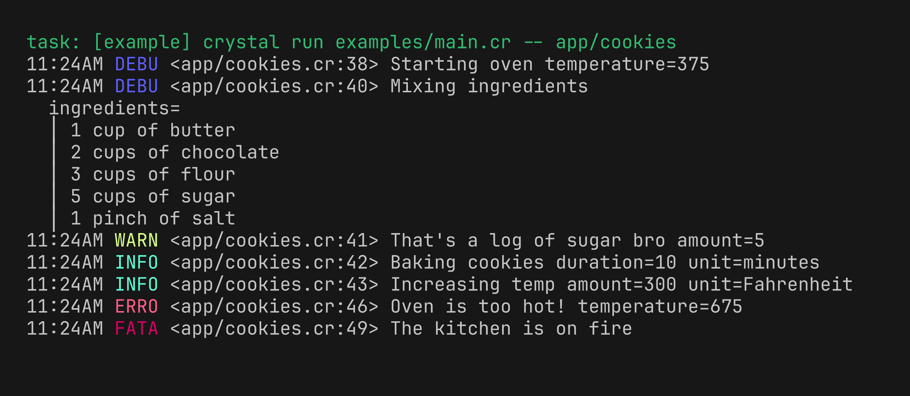

# etch

> Pretty. Little. Crystal logs.

Etch is a structured logger for Crystal focused primarily on serving human-readable output for CLI and TUI applications. But it can be your one and only logging library for other usecases too, with its structured fields, terminal-aware styles, machine-readable formatters, and an adapter for Crystal's standard `Log` backend API.

Inspired by our friends at Charm who built [log](https://github.com/charmbracelet/log).



## Why etch?

- **Small, ergonomic API.** Log through package-level methods or construct independent logger instances.
- **Structured fields.** Attach typed key-value data at the call site or bind fields to reusable sub-loggers.
- **Readable terminal output.** Text logs include styled levels, quoting, multiline values, timestamps, prefixes, and optional caller locations.
- **Terminal-aware styles.** Etch renders through [sheen](https://github.com/lowkeyliesmyth/sheen), respecting terminal color capabilities and `NO_COLOR`.
- **Three formatters.** Switch between styled text, JSON, and logfmt without changing logging calls.
- **Crystal integration.** Use Etch directly or route Crystal's standard `Log` entries through `Etch::Backend`.

## Installation

1. Add etch to your `shard.yml`:

```yaml
dependencies:
  etch:
    github: lowkeyliesmyth/etch
```

2. Then run `shards install`.

## Quick start

```crystal
require "etch"

Etch.info "Baking cookies", batch: 2
Etch.warn "Oven is running hot", temperature: 425
Etch.error "Batch failed", err: "cookies burned"
```

The package-level default logger writes to `STDERR` and includes a date-timestamp on every event. Create a logger explicitly to selectively override default configs to configure output and behavior:

```crystal
logger = Etch::Logger.new(
  STDOUT,
  level: :debug,
  prefix: "bakery",
  report_timestamp: true,
)

logger.debug "Preparing dough", batch: 2
# 2025/08/31 13:16:50 DEBU bakery: Preparing dough batch=2

logger.info "Cookies are ready", count: 24
# 2025/08/31 13:16:51 INFO bakery: Cookies are ready count=24
```

## Examples

The [`examples/`](examples/) directory contains runnable example consumers covering the primary formatter, style, and stdlib API integrations.

```bash
# List available examples
task example

# Run one example
task example -- app/cookies

# Run every example
task examples
```

## Feature tour

### Levels and fields

Etch provides `debug`, `info`, `warn`, `error`, and `fatal` levels. `print` always emits the message without any level label included.

```crystal
logger = Etch::Logger.new(level: :debug)

logger.debug "Mixing ingredients", bowl: 1
logger.info "Baking cookies", duration: 10, unit: "minutes"
logger.warn "Oven is hot", temperature: 425
logger.error "Timer failed", err: "not responding"
logger.print "Unleveled output"
```

Each level method also has a `sprintf` formatted variant available like `debugf` and `infof`. 

```crystal
logger.infof "Baked %d cookies", 24
logger.debugf "Containing %s chocolate chips", "a bajillion" 
```

Block forms lazily exercise expensive message construction only when the level is actually enabled:

```crystal
logger = Etch::Logger.new(
  STDOUT,
  level: :info,
)

logger.debug { "Inventory: #{expensive_inventory_report()}" } # Isn't evaluated or emitted
```

Pass in any enumerable of string-value pairs to the logger call to include field names known only at runtime as k-v record entries:

```crystal
fields = {"batch" => 2, "oven" => "north"}
logger.info "Baking cookies", fields
```

### Sub-loggers

Use `#with` to clone a parent logger instance along with its config, binding new k-v fields to the returned child. The parent logger remains pristine.

```crystal
batch = logger.with(batch: 2, chocolate_chips: true)

batch.debug "Preparing dough"
# DEBU Preparing dough batch=2 chocolate_chips=true
batch.info "Adding chocolate chips"
# INFO Adding chocolate chips batch=2 chocolate_chips=true


oven = batch.with_prefix("oven")
oven.info "Baking"
# INFO oven: Baking batch=2 chocolate_chips=true

```

### Formatters

Etch provides three builtin formatters, with the text formatter as the default. JSON and logfmt provide unstyled, machine-readable output.

```crystal
text = Etch::Logger.new(STDOUT, report_timestamp: true, formatter: :text)
json = Etch::Logger.new(STDOUT, report_timestamp: true, formatter: :json)
logfmt = Etch::Logger.new(STDOUT, report_timestamp: true, formatter: :logfmt)

text.info "Baking cookies", batch: 2
# 2025/08/31 13:16:50 INFO Baking cookies batch=2

json.info "Baking cookies", batch: 2
# {"time":"2025/08/31 13:16:50","level":"info","msg":"Baking cookies","batch":2}

logfmt.info "Baking cookies", batch: 2
# time="2025/08/31 13:16:50" level=info msg="Baking cookies" batch=2

```

You can also change the formatter on an existing logger:

```crystal
logger.formatter = :json
```

### Styles

Text output is styled with sheen. Start with the standard `Etch::Styles.default` and replace the presentation facets that you just can't live without. Change the level strings and backgrounds, modify the key and value colors and weights. 

The sky is the limit! 

```crystal
styles = Etch::Styles.default
styles.levels[Etch::Level::Error] = Sheen::Style.new
  .string("ERROR!!")
  .padding(0, 1)
  .background(Sheen.color("#ff5f5f"))
  .foreground(Sheen.color("#000000"))
styles.keys["err"] = Sheen::Style.new
  .foreground(Sheen.color("#ff5f5f"))
styles.values["err"] = Sheen::Style.new.bold

logger = Etch::Logger.new(STDERR, styles: styles)
logger.error "This is fine", err: "kitchen on fire"
```

BTW, Styles are only applied to text formatter output. JSON and logfmt formatters are too straight-laced and ~~have no style~~ remain unstyled.

### Fiber-local loggers

Use `Etch.with_logger` to temporarily route package-level calls through another logger. The previous logger is restored even if the block raises.

```crystal
request_logger = Etch.with(request_id: "req-42")

Etch.with_logger(request_logger) do
  Etch.info "Handling request"
  Etch.from_fiber.info "Still using the request logger"
end
```

The override belongs only to the current fiber. A fiber spawned inside the block uses `Etch.default` unless it establishes its own override.

Etch captures caller locations with Crystal's compile-time `__FILE__` and `__LINE__` pseudo-constants rather than walking the runtime stack. A logging helper that preserves its caller should accept and forward them explicitly:

```crystal
def start_oven(
  temperature : Int32,
  __file : String = __FILE__,
  __line : Int32 = __LINE__,
) : Nil
  Etch.debug(
    "Starting oven",
    temperature: temperature,
    __file: __file,
    __line: __line,
  )
end
```

### Fatal handling

`fatal` writes a record and raises `Etch::FatalError`, it never exits the process directly. Use `fatal` for an unrecoverable condition that needs to terminate the current command/workflow after recording why it failed. Don't simply use it for errors, that's what warn and error levels are for.

Wrap an application's top-level workflow with `Etch.run` to exit with status 1 after a fatal record:

```crystal
Etch.run do
  bake_cookies
  Etch.fatal "The kitchen is on fire" if oven_on_fire?
end
```

Use `Etch.status` when the application owns cleanup or process termination:

```crystal
status = Etch.status do
  bake_cookies
ensure
  cleanup
end

exit status
```

A `FatalError` unwinds the fiber it was raised in, so one raised inside a spawned fiber is not rescued by a surrounding `Etch.run`. Rescue the error inside the spawned fiber or send the failure through a channel and raise it again in the fiber calling `Etch.run`.

### Stdlib `Log` integration

`Etch::Backend` routes Crystal stdlib `Log` entries through the same formatter pipeline:

```crystal
require "etch"
require "log"

backend = Etch::Backend.new(STDERR)

Log.setup do |config|
  config.bind "*", :info, backend
end

Log.info { "Routed through etch" }
```

The backend preserves entry timestamps, sources, metadata, context, and exceptions. Stdlib's standard extended severities map onto Etch's smaller level set: 
- trace and debug => debug
- info => info
- notice and warn => warn
- error => error
- fatal => fatal

Setting `report_caller: true` is not supported by `Etch::Backend` (and will actually raise if you try to) because a `Log::Entry` doesn't have a caller file and line. 

## Development

```bash
# Install dependencies
shards install

# Run the spec suite
task spec

# Run the linter
task lint

# Type-check all examples
task examples:check

# Format Crystal sources
crystal tool format
```

## Contributing

Ran into a problem? Issues are welcome. Or if you're inclined to file a PR, see [CONTRIBUTING.md](CONTRIBUTING.md) to get set up.

## Contributors

- [lowkey](https://github.com/lowkeyliesmyth) - creator and maintainer

## License

MIT License - see [LICENSE](LICENSE) for details.
